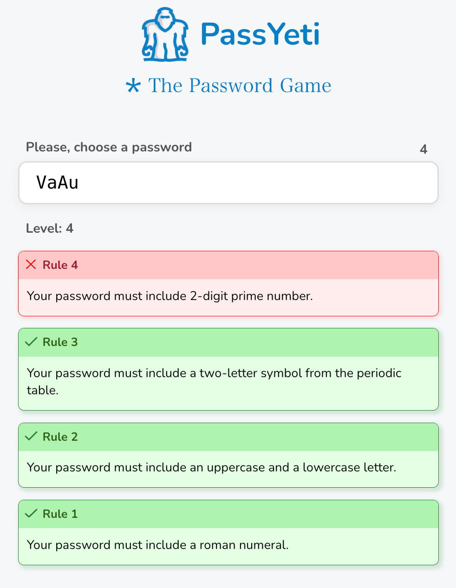

# PassYeti Game

> ReactJS game that challenges your password, your patience, your sanity, and your will to live ⛔️

🔐 Welcome to [`PassYeti`](https://passyeti.netlify.app).  It's a play on the classic problem of generating a secure password by coupling it with a frustrating mix of increasingly difficult rules. 

👾 Get ready to create the most complicated password of your life. You must craft a password that adheres to a series of increasingly absurd rules. Enjoy a variety of mini-games that incorporate puzzles and riddles to enhance the gameplay experience. The game ends when you've satisfied all the rules.

  <a href="https://passyeti.netlify.app">
    <strong>Play PassYeti now ▶️</strong>
  </a>
   
  
     

> The idea for this game comes from [`The Password Game`](https://neal.fun/password-game/) made by Neal and [`QuirkyLock`](https://github.com/sayantanDs/quirkylock) project. Go check out the originals, if you haven't played it yet.

## Development

### Getting Started

1. Clone this repository to your local machine using `git clone https://github.com/kraloveckey/passyeti.git`.
2. Navigate to the project directory using the command line: `cd passyeti`.
3. Install the required dependencies by running `npm install`.
4. Start the development server with `npm run dev`.
5. Open your web browser and go to `http://localhost:3000` to play the game.

> If you find a bug or have suggestions for improvements, please open an issue or create a pull request.

## Acknowledgements

- This game is heavily inspired by [`The Password Game`](https://neal.fun/password-game/) by Neal and the [`QuirkyLock`](https://github.com/sayantanDs/quirkylock) project.
- This game was developed using the [Next.js](https://nextjs.org/) framework.

---

